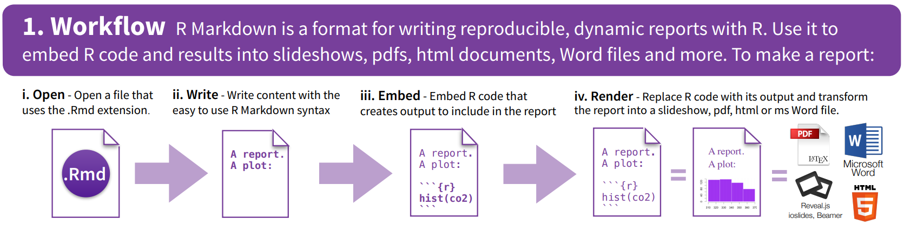

```{r setup, include=FALSE}
knitr::opts_chunk$set(echo = TRUE)
```

```{r panelset, echo=FALSE}
xaringanExtra::use_panelset()
```

# What is RMarkdown?

::: {.panelset}

::: {.panel}
#### Go from this
:::

::: {.panel}
#### To this!
:::

:::


## What's the point?

Rmarkdown documents combine the analytical power of R and the utility of a text-processor. 
We can have one document which contains all of our analysis as well as our written text, and can be _compiled_ into a nicely formatted report. This saves us doing analysis in R and copying results across to Microsoft Word. It ensures our report accurately reflects our analysis. Everything that you're reading now has all been written in Rmarkdown!

The fundamental idea of RMarkdown is to be able to write normal text interspersed with "code-chunks" (i.e., chunks of code!). With RMarkdown documents we are able to see and edit the code along with specifying formatting of our text. We then __compile__ our document into a nice file (e.g. a __.pdf__ file or a __.html__ file) which formats our text and shows/hides code and output according to what we have specified.  You can see an RMarkdown workflow in Figure \@ref(fig:workflow) 

```{r workflow, echo=FALSE, fig.cap="RMarkdown Workflow (from https://www.rstudio.com/wp-content/uploads/2015/02/rmarkdown-cheatsheet.pdf)"}

```


# Knitting a script

To show the general process of going from something that we edit and evaluate in R using RStudio, to something more like a read-only document, it is worth first exploring how we can turn any R script into an __.html__ or __.pdf__ 

Step 1. Find an R script on your computer that runs from start to finish without any errors. If you don't have one to hand, you can download an example script from here: [TODO link]()  
Step 2. Know *where* on your computer that document is.  
Step 3. In the **console**, type `knitr::spin("insert-your-filepath-here.R")` and press enter.  


# Getting Started

First things first, we need to open an RMarkdown document.  

In the top menu bar, click on **File > New File > RMarkdown**  
A dialgue box will pop-up 


# yaml

The bit at the top of your document between the three dashes `---` is the *"metadata"*. This is the information **about** your document. Things like the title, author, output format (html/pdf). For now, we can leave it as it is, but there are lots and lots of features you can exploit via the yaml, such as including stylesheets for html (which is how we set the colours/fonts etc in these pages), to setting custom parameters which enable you to bulk create multiple reports for different values (e.g. a different report on each country in a list). We won't cover this sort of stuff in this course as it is not so useful for producing scientific reports, but once you are an RMarkdown pro, if you get interested in this sort of thing there is lots of info at https://bookdown.org/yihui/rmarkdown/params-knit.html.  

We will come back to editing the yaml a little bit in [Chapter 7](07-refs.html), but for now we can leave it as it is, having been automatically generated based on the author and title we gave the little pop-up box. 

# Text and Code-Chunks


# Headings


## Readings

For further information, check to the following:

