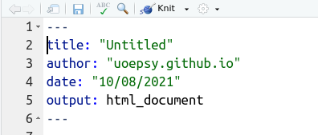

```{r setup, include=FALSE}
knitr::opts_chunk$set(fig.align = 'center')
```

```{r panelset, echo=FALSE}
xaringanExtra::use_panelset()
```


```{css echo=FALSE}
.spc1{
  background-color: #eaeaea;
}
.spc1 code{
  font-size: .8em !important;
}
.frame {
    border: 1px solid #333333 !important; 
    border-radius: 5px; 
    padding: 20px 20px 10px 20px; 
    margin-top: 20px; 
    margin-bottom: 20px; 
}
.imp{
  border-left: 5px solid #FF3131;
  padding: 20px 20px 10px 20px; 
  margin-top: 20px; 
  margin-bottom: 20px; 
}
```

# Pre-requisites to enable referencing  

To enable cross referencing of plots, figures and tables, we need to change the output of our document slightly. 

We're going to need to change the __yaml:__  

```{r echo=F, fig.cap="The bit between three dashes is the `YAML`, and contains metadata about the document"}

```

Rather than using `output: html_document` or `output: pdf_document`, we are going to need to use some specific classes of output. The easy ones to start with are in the __bookdown__ package.  
Install the bookdown package and then change your output type to either `bookdown::html_document2` or `bookdown::pdf_document2`. This will allow us to do the various referencing of Figures and Tables detailed below. 

```{}
---
title: "this is my title"
author: "I am the author"
date: "13/08/2021"
output: bookdown::html_document2
---
```

# Chunk names!  

We reference a figure or table based on the code-chunk in which it is produced. For example, once we provide a name for the code-chunk below ("penguinplot") we can then reference in text the Figure which has been produced by that chunk, and the numbering will be automatically sorted for us! 

<div class="spc1"><code>
&grave;&grave;&grave;{r penguinplot, fig.cap="Counts of penguins of different species"}<br>
library(palmerpenguins)<br>
barplot(table(penguins$species))<br>
&grave;&grave;&grave;
</code></div><br>

# Referencing a figure 

To reference a figure, we use the format \\\@ref(fig:**chunkname**), where **chunkname** is the name of the code-chunk that outputs our figure. You can find an example below. 

::: {.panelset}

::: {.panel}
#### Write this: 

```
As you can see in Figure \@ref(fig:penguinplot), there are various penguins of different species
```

<div class="spc1"><code>
&grave;&grave;&grave;{r penguinplot, fig.cap="Counts of penguins of different species"}<br>
library(palmerpenguins)<br>
barplot(table(penguins$species))<br>
&grave;&grave;&grave;
</code></div><br>

:::

::: {.panel}
#### Compiles to this:

As you can see in Figure \@ref(fig:penguinplot), there are various penguins of different species

```{r penguinplot, fig.cap="Counts of penguins of different species"}
library(palmerpenguins)
barplot(table(penguins$species))
```

:::

:::


# Referencing a table

To reference a table, we use the format \\\@ref(tab:**chunkname**), where **chunkname** is the name of the code-chunk that outputs our table. You can find an example below. 

::: {.panelset}

::: {.panel}
#### Write this: 

```
As you can see in Table \@ref(tab:penguinplot), there are various penguins of different species
```

<div class="spc1"><code>
&grave;&grave;&grave;{r penguintable}<br>
library(palmerpenguins)<br>
knitr::kable(table(penguins$species), caption = "counts of penguins of different species")<br>
&grave;&grave;&grave;
</code></div><br>

:::

::: {.panel}
#### Compiles to this:

As you can see in Table \@ref(tab:penguintable), there are various penguins of different species

```{r penguintable}
library(palmerpenguins)
knitr::kable(table(penguins$species), caption = "counts of penguins of different species")
```

:::

:::


